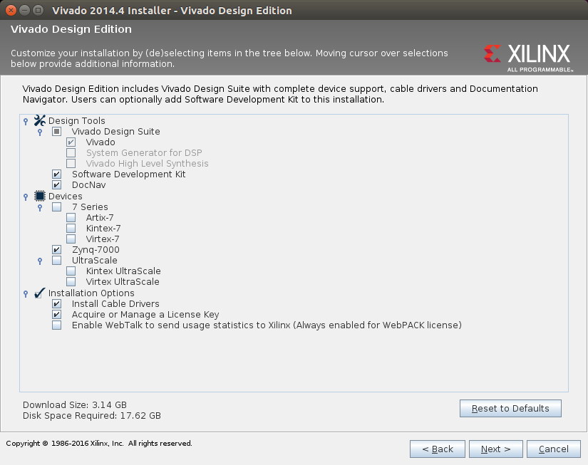
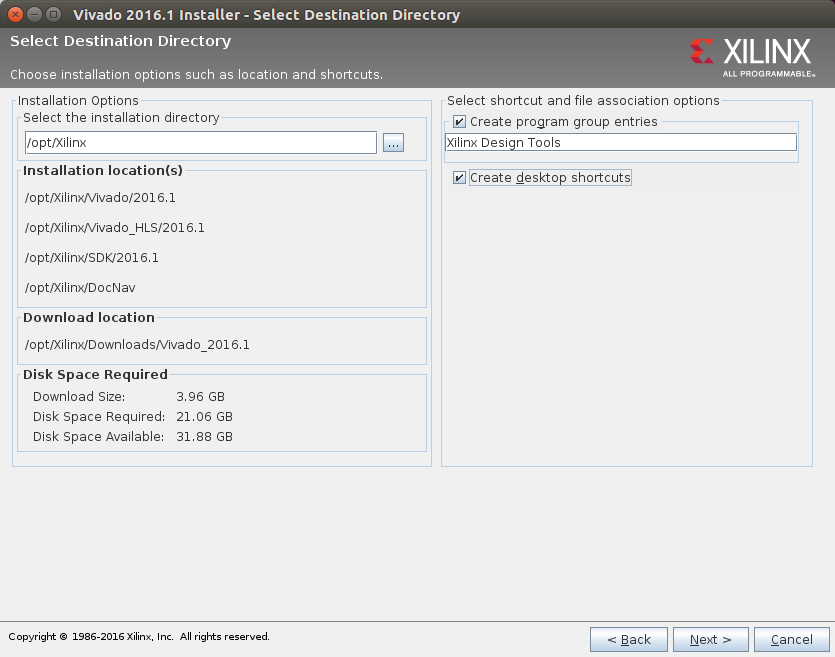
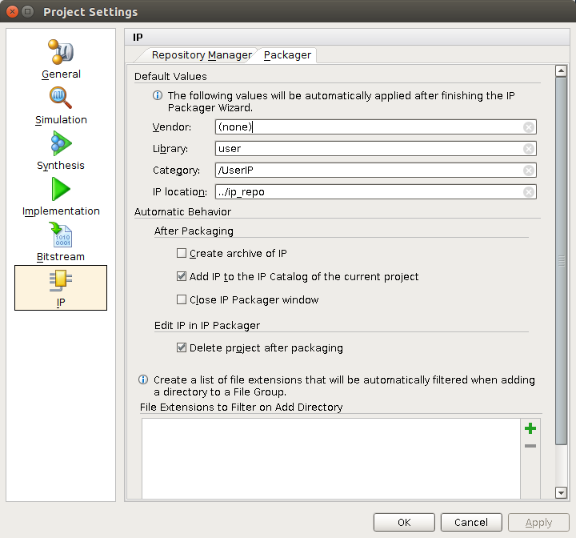

# Setting up Vivado on Linux

Start by downloading the lastest Linux version 2014.4 of Vivado from [Xilinx's website](http://www.xilinx.com/support/download.html). Currently, Xilinx provides web installers, so the initial download is fairly small.

Once downloaded the file must be made executable and then installed.

```bash
cd ~/Downloads
chmod +x Xilinx_Vivado_SDK_2014.4_1119_1_Lin64.bin
sudo ./Xilinx_Vivado_SDK_2014.4_1119_1_Lin64.bin
```

Once the installation is started, make sure include the Software development kit, DocNav, and install the cable drivers. Since, the Zybo is a Zynq-7000 you only need to select Zynq-7000 in the devices section.



In Linux it is a good idea to install user applications inside the opt folder. Note, if you didn't run the installer with sudo, it will fail to write to the opt folder.



Click yes, if it asks you to create the folder. Continue with the installation until finished.

After the installation is complete, the Vivado License Manager will pop up. Close it, because it will try to put the license in your root directory.

Next, you need to install the cable drivers for the Zybo.

```bash
cd /opt/Xilinx/Vivado/2014.4/data/xicom/cable_drivers/lin64/install_script/install_drivers
sudo ./install_drivers
```
You also need to source Vivado's settings.

```bash
source /opt/Xilinx/Vivado/2014.4/settings64.sh
```

Note, you should add the line ``source /opt/Xilinx/Vivado/2014.4/settings64.sh`` to your terminal's rc file (normally ~/.bashrc). So that the command is run everytime you use your terminal.

You might also need to change the ~/.Xilinx folder's group and owner for Vivado to start correctly. 

```bash
sudo chgrp -R <your-user-name> ~/.Xilinx
sudo chown -R <your-user-name> ~/.Xilinx
```

Now, we will include the license from Xilinx. To start the license manager type ``vlm`` into a terminal. To create a license go to Xilinx's [license managment page](http://www.xilinx.com/getlicense). Xilinx also offers free WebPack licenses. Once you fill out the licensing information, Xilinx will send you an email with the license. Download the license from the email and follow the instructions in the email to complete to load the license.

To start Vivado type ``vivado &`` in a terminal. Make sure to start Vivado in a directory you are able to write to, as Vivado creates log files in the directory you start it from.

If you want Vivado to start from the applications menu, you need to create a desktop file. The location for adding desktop entries is generally ``/usr/share/applications``

```bash
cd /usr/share/applications
sudo gedit vivado.desktop
```

Add the following text to the file.

```
[Desktop Entry]
Version=1.0
Type=Application
Name=Vivado
Icon=/opt/Xilinx/Vivado/2014.4/doc/images/vivado_logo.ico
Exec=/opt/Xilinx/Vivado/2014.4/bin/vivado -nolog -nojournal
Categories=Development;IDE;
Terminal=false
```

This should allow you to start Vivado from the applications menu, without having to go through a terminal.

Next, you need to add Zybo board files to Vivado's boards directory. You can download the board files from [Digilent's github repo](https://github.com/Digilent/vivado-boards/). Click the download zip button to download a zip of the repo. Unzip the folder and move it to ``/opt/Xilinx/Vivado/2014.4/data/boards/board_files``.

```bash
cd ~/Downloads
unzip vivado-boards-master.zip
sudo cp -r vivado-boards-master/old/board_files/zybo/ /opt/Xilinx/Vivado/2014.4/data/boards/board_parts/zynq/
```

You can delete the vivado-boards-master folder and zip now. If you restart Vivado, Zybo should show up as an option under boards in the project creation menu. Now you should be able to use Vivado and Xilinx's SDK. 

Lastly, you need to add yourself to the list of users allowed to access the serial ports. Without this you will not be able to access the USB UART in Xilinx's SDK.

```bash
sudo addgroup <your-username> dialout
```

Now, logout and log back in for the changes to take affect. Also, on several Linux distributions (specifically Ubuntu) the serial ports drivers do not work in Xilinx's SDK. To fix this we need to compile a new set of drivers.

```bash
cd ~
wget http://rxtx.qbang.org/pub/rxtx/rxtx-2.2pre2.zip
unzip txtx-2.2pre2.zip
cd rxtx-2.2pre2
./configure --disable-lockfiles
make
```

The build will fail, but it's ok.

```bash
cd /opt/Xilinx/SDK/2014.4/eclipse/lnx64.o/plugins/gnu.io.rxtx.linux.x86_64_2.1.7.3_v20071015/os/linux/x86_64
sudo mv librxtxParallel.so librxtxParallel.old
sudo mv librxtxSerial.so librxtxSerial.old
sudo mv ~/rxtx-2.2pre2/x86_64-unknown-linux-gnu/.libs/librxtxParallel.so .
sudo mv ~/rxtx-2.2pre2/x86_64-unknown-linux-gnu/.libs/librxtxSerial.so .
sudo mv ~/rxtx-2.2pre2/x86_64-unknown-linux-gnu/.libs/librxtxSerial-2.2pre1.so .
```

Note, when configuring XSDK serial ports the port is generally ``/dev/ttyUSBX`` where X is a number. If you start with the Zybo's USB disconnected and type ``ls /dev/ttyUSB*`` into a terminal and then connect the USB and power on the Zybo. Run ``ls /dev/ttyUSB8`` command again. The new number is the Zybo's port.

If you plan on creating IPs with Vivado in Linux it will not work unless you set the vendor name.To set the vendor name create a project and look in the flow navigator for the Project Settings menu. Once the menu pops up, click the IP button in the button left. Then navigate to the packager tab, fill in the vendor text field, and click ok.



